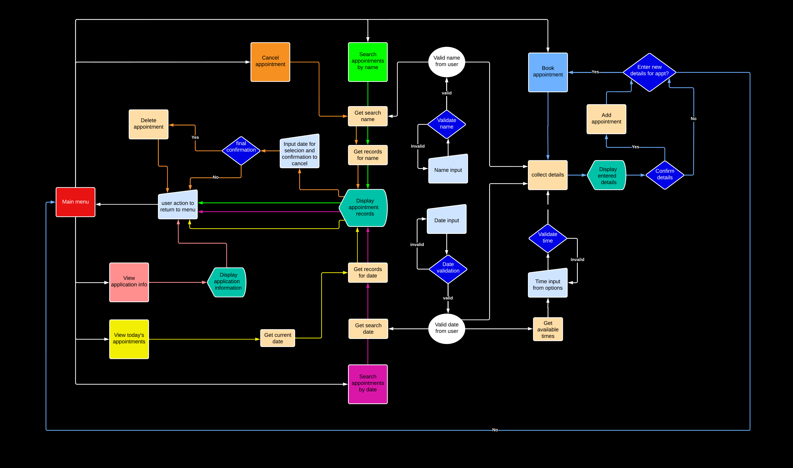

# Doctor's Diary

Doctor's Diary is a CLI data automation program designed to run on a mock terminal in Heroku. The program is aimed at helping a small medical practice manage and keep track of patient appointments.

## Purpose

The purpose of this program is to make appointment booking and record tracking easier and faster for the user. It provides the ability to input data that has been validated and retrieve specific data upon request. It is intended to enable the user to easily create, delete and view specific records. 

This program is developed to demonstrate competency in python programming and is purely for educational purposes.

## User Experience

### Project Goals

As the site owner, I want the program to:
* provide information on how to use it.
* be easy to navigate.
* provide feedback or a response to the user when they perform a task or action.
* provide the user with the ability to perform tasks relative to the program's purpose.

### User Stories

As a user, I want to be able to:
* view informational content on how to properly use the program.
* book a new appointment with valid details.
   * enter a detail and have it validated before moving onto the next one.
   * confirm all the details before making the booking.
* view all appointments booked for the current date.
* search for appointments under a specific name and view them.
* search for appointments pertaining to a specific date and view them.
* cancel a specific appointment.

### Program flowchart

During the planning stages, I created a basic flowchart of how I wanted the program to work and interact.
The flowchart was created using [Lucidchart](https://www.lucidchart.com/pages/).

## Features

## Technologies used

* [Lucidchart](https://www.lucidchart.com/pages/).
   * Used to create a flowchart during the planning stage.
* [HTML5](https://html.spec.whatwg.org/)
   * Used to add structure and content for the site.
   * (provided in the [code intitute template](https://github.com/Code-Institute-Org/python-essentials-template)).
* [CSS](https://www.w3.org/Style/CSS/Overview.en.html)
   * Used to provide styling for the site.
   * (provided in the [code intitute template](https://github.com/Code-Institute-Org/python-essentials-template)).
* [Python](https://www.python.org/)
   * Used to provide functionality to the site.
* [Google Sheets](https://www.google.co.uk/sheets/about/)
   * Used to host application data.
* [Gitpod](https://www.gitpod.io/#get-started)
   * Used to create the code and content for the repository.
* [Github](https://github.com/)
   * Used to host the repository.

## Python Packages

## Testing

## Deployment and Development

* The project was developed using [Gitpod](https://www.gitpod.io/#get-started) to create the code and files required.
* The project files, code and information is hosted by [Github](https://github.com/).

### Deploying the App

The deployment of the project was done using [Heroku](https://www.heroku.com/) through the following steps.

1. Log in to Heroku or create an account if necessary.
2. Click on the button labeled "New" from the dashboard in the top right corner and select the "Create new app" option in the drop down menu.
3. Enter a unique name for the application and select the region you are in.
   * For this project, the unique name is "doctor-diary" and the region selected is Europe.
4. Click on "create app".
5. Navigate to the settings tab and locate the "Config Vars" section and click "Reveal config vars".
6. Add a config var (if project uses creds.json file.)
   * In the "KEY" field:
      * enter "CREDS" in capital letters.
   * In the "VALUE" field:
      * copy and paste the contents of your creds.json file and click "Add".
7. Add another config var.
   * In the "KEY" field:
      * enter PORT in all capital letters.
   * In the "VALUE" field:
      * enter 8000 and click "Add".
8. Scroll to the "Buildpacks" section and click "Add buildpack".
9. Select Python and save changes.
10. Add another buildpack and select Nodejs then save changes again.
11. Ensure that the python buildpack is above the Nodejs buildpack.
12. Navigate to the "Deploy" section by clicking the "Deploy" tab in the top navbar.
13. Select "GitHub" as the deployment method and click "Connect to github".
14. Search for the GitHub repository name in the search bar.
15. Click on "connect" to link the repository to heroku.
16. Scroll down and click on "Deploy Branch".
17. Once the app is deployed, heroku will notify you and provide a button to view the app.

NB - If you wish to rebuild the deployed app automatically everytime you push to github, you may click on "Enable Automatic Deploys".

### Forking the Repository

This can be done to create a copy of the repository. The copy can be viewed and editted without affecting the original repository.

To fork the repository through GitHub, take the following steps:
1. In the "the-everything-quiz" repository, click on the "fork" tab in the top right corner.
2. Click on "create fork" to fork the repository.

### Cloning the Repository

To clone the repository through GitHub:

1. In the repository, select the "code" tab located just above the list of files and next to the gitpod button.
2. Ensure HTTPS is selected in the dropdown menu.
3. Copy the URL under HTTPS.
4. Open Git Bash in your IDE of choice.
5. Change the current working directory to the location where you want the cloned directory to be created.
6. Type "git clone" and paste the URL that was copied from the repository.
7. Press the "enter" key to create the clone.
   
## Credits

## Acknowledgements