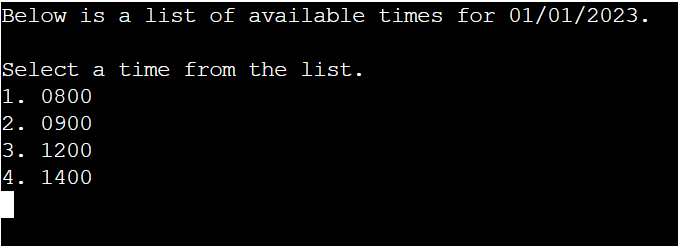

# Doctor's Diary

Doctor's Diary is a CLI data automation program designed to run on a mock terminal in Heroku. The program is aimed at helping a small medical practice manage and keep track of patient appointments.

View the live site [here](https://doctor-diary.herokuapp.com/).

## Contents

* [Purpose](#purpose)
* [User Experience](#user-experience)
   * [Project Goals](#project-goals)
   * [User Stories](#user-stories)
   * [Program Flowchart](#program-flowchart)
* [Data Storage](#data-storage-google-sheets)
* [Features](#features)
   * [Existing Features](#existing-features)
      * [The Main Menu](#the-main-menu)
      * [The Search Menu](#the-search-menu)
      * [The Search Results Display](#the-search-results-display)
      * [The Display For Today's Appointments](#the-display-for-todays-appointments)
      * [The Date Input Prompt](#the-date-input-prompt)
      * [The Time Input Prompt](#the-time-input-prompt)
      * [The Name Input Prompt](#the-name-input-prompt)
      * [The Booking Confirmation](#the-booking-confirmation)
      * [The Already Booked Display](#the-already-booked-display)
      * [The Cancelation Prompt](#the-cancelation-prompt)
      * [The confirmed Cancelation Display](#the-confirmed-cancelation-display)
      * [The Application Instructions Display](#the-application-instructions-display)
      * [The Emergency Exit Option](#the-emergency-exit-option)
      * [Feedback For Invalid Inputs](#feedback-for-invalid-inputs)
      * [Background Features](#background-features)
   * [Future Features](#future-features)
* [Technologies Used](#technologies-used)
* [Python Packages Used](#python-packages-used)
* [Testing](#testing)
   * [Python PEP8 Validation](#python-pep8-validation)
   * [Testing User Stories](#testing-user-stories)
   * [Development Bugs](#development-bugs)
* [Deployment and Development](#deployment-and-development)
   * [Deploying the App](#deploying-the-app)
   * [Forking The Repository](#forking-the-repository)
   * [Cloning The Repository](#cloning-the-repository)
   * [APIs](#apis)
* [Credits](#credits)
* [Acknowledgements](#acknowledgements)

## Purpose

The purpose of this program is to make appointment booking and record tracking easier and faster for the user. It provides the ability to input data that has been validated and retrieve specific data upon request. It is intended to enable the user to easily create, delete and view specific records. 

This program is developed to demonstrate competency in python programming and is purely for educational purposes.

## User Experience

### Project Goals

As the site owner, I want the program to:
* provide information on how to use it.
* be easy to navigate.
* provide feedback or a response to the user when they perform a task or action.
* provide the user with the ability to perform tasks relative to the program's purpose.

[Back to top](#contents)

### User Stories

NB - This app is intended to be used by an employee at a small medical practice. The idea is that the user will manage appointments based on requests from patients. An example is a case in which a patient phones the practice to either book or cancel an appointment and the user requests information from the patient to use in order to do so.

As a user, I want to be able to:
* view informational content on how to properly use the program.
* book a new appointment with valid details.
   * enter a detail and have it validated before moving on to the next one.
   * confirm all the details before making the booking.
* view all appointments booked for the current date.
* search for appointments under a specific name and view them.
* search for appointments pertaining to a specific date and view them.
* cancel a specific appointment.

[Back to top](#contents)

### Program flowchart

During the planning stages, I created a basic flowchart of how I wanted the program to work and interact.
The flowchart was created using [Lucidchart](https://www.lucidchart.com/pages/).

During development, I discovered a few things that needed to be added. These were mostly minor changes, however, the main adjustments that were made that were different from the flow chart were as follows:

* I felt it would provide a better experience if a separate menu for search options was present.
   * This made the content less overwhelming and cluttered and created a more organised site.
   * After a search, the user can opt for the search menu again or for the main menu.
* Instead of asking the user to manually input a date to choose a cancelation option, I found it was better to provide a list of options to choose from.
   * This meant less input was required from the user making the process much faster.
   * If only one option is available, the selection process is skipped altogether.

Although slight changes were made, the program generally follows the flow of the chart below and the purpose of the chart was to help me envision what I wanted to achieve and how I wanted to achieve it. It played a key role in planning and development overall.

[Back to top](#contents)

## Data Storage (Google Sheets)

The data for the application regarding appointments is stored in a google sheet. You can view the sheet [here](https://docs.google.com/spreadsheets/d/1VkeaoTuB1Q7BGQGjlcbhL3MWXIfrlZjKsobsegOslpQ/edit?usp=sharing).

## Features

### Existing Features

Doctor's Diary is designed with features that incorporate the purpose of the site. The design and display of the site is limited by factors such as the terminal size and the fact that it is done primarily using python as a CLI app. If the site were to incorporate an interface other than the command line interface for user interaction, a few improvements could be made for a better user experience.

However, the following features outline how the site is best designed to fit needs in its current state.

NB - The app is intended for a single user or a small number of users performing the same job at a medical practice.

* #### The Main Menu
   * When the page is first loaded, the user is presented with the main menu containing options to select from depending on what they want to achieve.

   

[Back to top](#contents)

* #### The Search Menu
   * The search menu is displayed when the user chooses the option to search for appointments.
   * This presents the user with options to search for specific appointments.
      * The user can search for a specific name or a specific date.
      * The user may also select an option to return to the main menu.
   
   

[Back to top](#contents)

* #### The Search Results Display
   * Once the user has input a name or date for searching and if appointments are found for the search, the relevant appointments are displayed in a table to be viewed.
      * If the user is searching for a name, only the date and time records will be shown in the table.
      * If the user is searching for a date, only the time and name records will be shown in the table.
   * Images for both displays are shown below.

   
   

   * If no appointments are found for the date or name searched for by the user, they are informed that no appointments exist for the searched detail and are provided with options to return to the search menu to search again or return to the main menu.

   
   

[Back to top](#contents)

* #### The Display For Today's Appointments
   * If the user selects the option in the main menu to view today's appointments, the same process is carried out as in the case of searching by date and the program uses the current date instead of an input date from the user.
   * The relevant responses are given for the result of the search as seen below.
      * If appointments are found for the current date, the records are displayed in a table.

      
      
      * If no appointments exist for the current date, the user is informed and given the option to return to the main menu or go to the search menu in case they would like to search for an appointment they expected to be on the current date.

      

[Back to top](#contents)

* #### The Date Input Prompt
   * This prompt is presented to the user whenever they select an option that requires them to input the date.
      * Date input is required for booking a new appointment and searching for appointments by date.
   * The prompt requests input from the user and informs them of the format they should use.

   

[Back to top](#contents)

* #### The Time Input Prompt
   * This prompt is presented to the user when they are booking a new appointment and need to select a time for the booking.
      * The user is presented with the times that are available for the date they input.
      * The times are presented in the form of a list from which the user can choose an option.
         * This way of presenting the times creates a better user experience as it removes the need to manually input a time and it keeps the same layout as choices shown in the main menu.
      * If the appointment being booked is for the current date, only available times that are in the future are listed as options.

   

[Back to top](#contents)

* #### The Name Input Prompt
   * This prompt is presented to the user whenever they select an option that requires them to input a name and surname.
      * Name inputs are required for booking new appointments, searching appointments by name, and canceling an appointment.
   * The contents of the prompt changes depending on which part of the name is being input (first name or surname) as seen in the images below.

   

   

[Back to top](#contents)

* #### The Booking Confirmation
   * Once the user has entered the necessary details, the appointment details to be booked are displayed in a table and the user is asked to confirm the booking or cancel it.

   

   * If the user confirms the booking, they are informed that the appointment has been booked successfully and are presented with options to book another appointment or return to the main menu.

   

   * If the user cancels the booking in the confirmation prompt, they are presented with options to enter new details or return to the main menu.

   

[Back to top](#contents)

* #### The Unavailable Date Display
   * If the user enters a date for an appointment booking and there are no times available for that date, they are informed that it is unavailable and are prompted to enter a new date.

   

* #### The Already Booked Display
   * If the user enters details to book an appointment but an appointment has already been booked for the name and date input, they are informed that they cannot book more than one appointment on the same day for one patient and are given options to enter new details or return to the main menu.
   * This prevents a single patient from having multiple unnecessary appointments on the same day, making them unavailable to other patients.

   

[Back to top](#contents)

* #### The Cancelation Prompt
   * When the user selects the option in the main menu to cancel an appointment, they are prompted to enter a name to search for and are then presented with a prompt to confirm the cancelation.
      * If no appointments are found for the searched name, the user is informed and they can choose to search again or return to the menu.

      

      * If one appointment is found for the searched name, The user is presented with the appointment in question and is asked to provide confirmation to cancel it. If the user decides not to cancel the appointment, the cancelation does not occur and they return to the main menu.

      

      * If multiple appointments are found for the searched name, The user is presented with a list of the appointments and is asked to select one to cancel as seen in the image below.
      * Once the user inputs a choice, they are asked to confirm the cancelation as in the image above.

      

[Back to top](#contents)

* #### The confirmed Cancelation Display
   * If the user confirms a cancelation, they are informed that the cancelation was successful and are prompted to press "enter" to return to the main menu.

   

[Back to top](#contents)

* #### The Application Instructions Display
   * Instructions on how to use the application are provided for the user.
   * They can view these instructions by selecting the option in the main menu to view application instructions.
   * This feature helps the user understand how to navigate the app and how to achieve their desired goals within the app.

   

[Back to top](#contents)

* #### The Emergency Exit Option
   * This is an option provided for the user to be able to exit a booking process or cancelation process while entering details.
   * To stop the processes, the user can input "Exit" when asked for any detail.
   * If they do this, they automatically return to the main menu and the process is ended.
   * This creates a better user experience by providing a way to exit a booking or cancelation process at any stage instead of having to wait until the end to cancel it.
   * The availability of this option is made clear in the application instructions display as seen above.
      * I did not include a print statement in every input prompt outlining the option to exit as it would create lengthy and repetitive messages for the user. I felt it was sufficient just to mention it in the application instructions especially as the site is only intended for a single user or a smaller number of users as mentioned at the beginning of the [features](#features) section. I felt this created a better user experience overall.

[Back to top](#contents)

* #### Feedback For Invalid Inputs

   Every input the user enters is validated to ensure it meets the required standards for the app. If invalid input is entered, the user is notified that it is invalid, informed of the necessary requirements for the input, and requested to input new valid data.

   * Feedback For Invalid Name Inputs
      * A valid name input must:
         * Contain only letters.
         * Contain at least two letters.
         * Contain no white space.
      * If invalid input is entered for either the first name or surname, the following message is displayed.

      
      
      

[Back to top](#contents)

   * Feedback For Invalid Date Inputs
      * A valid date input must:
         * Be in the format of dd/mm/yyyy.
         * Contain realistic values for day, month, and year categories.
      * If invalid input is entered for a date, the following message is displayed.

      

      * If the date input is for the purpose of booking a new appointment, it must also be for a present or future date.
      * If the date is in the correct format but is a date of the past, the following message is displayed.

      

[Back to top](#contents)
   
   * Feedback For Invalid Time input
      * The times are presented as a list of options to choose from.
      * If the user enters an option that is not in the list, the following message is displayed.
         * Note that the same validation process is carried out when a user needs to select an appointment to cancel from a list of options.

      

[Back to top](#contents)

* Feedback For Invalid Option Input
   * Throughout the site, the user is presented with options to choose from.
   * If the user inputs data that is not part of the available options, they are informed and asked to input an option within the given range.
   * An example of this is shown below for the main menu options.

   

[Back to top](#contents)

* #### Background Features

   During the running of the program, a few background features take place. These features include:

   * Sorting the spreadsheet.
      * Whenever the app is run or new data is added to the spreadsheet, the sheet is sorted by date and then by time.
      * This helps keep tidy records that are easier to view and understand.
   
   * Deleting past appointments
      * Each time the app is run, any appointments that contain dates in the past are deleted.
      * This also helps keep tidy records and ensures that no unnecessary records are being kept.

[Back to top](#contents)

### Future Features

Features to be implemented in the future may include:
* A feature to record which member of staff entered the details for a given appointment.
   * This would be for a case where there is more than one user.
* Patient contact details being part of the booking details so that the medical practice can get in contact with them on the day of booking.
   * A feature whereby the patient is automatically emailed a reminder of the appointment is also an option to implement for this.

[Back to top](#contents)

## Technologies used

* [Lucidchart](https://www.lucidchart.com/pages/).
   * Used to create a flowchart during the planning stage.
* [HTML5](https://html.spec.whatwg.org/)
   * Used to add structure and content for the site.
   * (provided in the [code institute template](https://github.com/Code-Institute-Org/python-essentials-template)).
* [CSS](https://www.w3.org/Style/CSS/Overview.en.html)
   * Used to provide styling for the site.
   * (provided in the [code institute template](https://github.com/Code-Institute-Org/python-essentials-template)).
* [Python](https://www.python.org/)
   * Used to provide functionality to the site.
* [Google Sheets](https://www.google.co.uk/sheets/about/)
   * Used to host application data.
* [Gitpod](https://www.gitpod.io/#get-started)
   * Used to create the code and content for the repository.
* [Github](https://github.com/)
   * Used to host the repository.

[Back to top](#contents)

## Python Packages Used

* [GSpread](https://pypi.org/project/gspread/)
   * Used to manipulate data in google sheets.
* [Datetime](https://docs.python.org/3/library/datetime.html)
   * Used to manipulate dates and times.
* [OS](https://docs.python.org/3/library/os.html)
   * Used to clear the terminal.
* [Tabulate](https://pypi.org/project/tabulate/)
   * Used to present data in a table format.
* [PyInputPlus](https://pypi.org/project/PyInputPlus/)
   * Used to display input options as a menu and validate the selected choice.

[Back to top](#contents)

## Testing

Various tests were carried out for this project.

NB - HTML, CSS, and JavaScript were provided in the [code institute template](https://github.com/Code-Institute-Org/python-essentials-template) and are not in scope for this project as well as the aspect of responsive design, therefore they were not taken into consideration.

### Python PEP8 Validation

During the development of this project, PEP8online.com was down and therefore I resorted to adding a PEP8 validator to the Gitpod Workspace. This was done using the "pip3 install pycodestyle" command in the terminal and adjusting settings to use it to validate my code.

When I used the PEP8 validator on my code, a few issues were raised which are shown in the image below.:

* Line too long.
   * This error was raised as a result of the line of code being too long.
   * This was resolved by adjusting the content of print statements and the structure of code to fit within the correct line length.
* Blank line contains white space.
   * This is a self-explanatory warning and was resolved by removing the white spaces on blank lines.
* Trailing whitespace.
   * This is also self-explanatory and was resolved by removing the white space at the end of the lines in question.

Once these issues were resolved, no errors or warnings were shown for my code (run.py).

NB - Some warnings were shown in relation to the [code institute template](https://github.com/Code-Institute-Org/python-essentials-template) (gitpod.yml), however, these were not in scope for this project and had no impact on the running of the app so they were not addressed.

[Back to top](#contents)

### Testing User Stories

As a user, I want to be able to:
* view informational content on how to properly use the program.
   * There is a main menu option dedicated to displaying instructions on how to use the application.
   * Prompts for input are clear and worded well to ensure the user knows how to respond.
   * Feedback is given for any wrong input to ensure the user knows how to input correct data.
* book a new appointment with valid details.
   * An option is available in the main menu to book a new appointment.
   * The user is prompted for details and is provided with information on the requirements for valid input.
   * The user can move on to the next detail only once a valid input has been made.
   * The user is presented with the final details for confirmation and they can choose to make the booking or cancel it.
   * The user can opt to book another appointment after a booking has been made without having to return to the main menu.
* view all appointments booked for the current date.
   * An option is available in the main menu to view appointments for the current date and automatically responds to the request without having to input the date.
* search for appointments under a specific name and view them.
   * The user can navigate to the search menu and select the option to search by name.
   * This enables the user to enter any name they wish to search for and view the results of their search.
* search for appointments pertaining to a specific date and view them.
   * The user can navigate to the search menu and select the option to search by date.
   * This enables the user to enter any date they wish to search for and view the results of their search.
* cancel a specific appointment.
   * In the main menu is an option to cancel an appointment.
   * This enables the user to cancel an appointment for a specific name and date.

Throughout the application, the user can return to the main menu in order to select a different option and perform a new task.

[Back to top](#contents)

### Development Bugs

During development, manual testing was carried out for each feature. A few problems were found and resolved. The final outcome was that all features worked as intended as can be seen in the [features section](#features).

The problems encountered during development are shown below.

* When booking a new appointment for the current date, the user was able to book a time that had already passed.
   * This was resolved by adding an if statement to check if the date entered is the current date and if it is, removing times that are in the past from the list of available times.
   * I used the [Datetime](https://docs.python.org/3/library/datetime.html) module to carry out these checks.

* When data was added to the spreadsheet for a new appointment, the date was being added as a string rather than a date.
   * This was resolved by adding "value_input_option='USER_ENTERED'" to the append_row method of [GSpread](https://pypi.org/project/gspread/) when a new row of data was being added to the sheet.

* When details were entered for a new appointment, the program checks if the name has been booked for the specified date already. This worked to an extent however it did not check for name order. For example:

   If the name entered was "Michael Shawn", and an appointment existed for the name "Shawn Michael", the program would return that an appointment has already been booked even though the name is in a different order and could be a different person.
   * This issue was resolved by adding a for loop with an if statement to check if the name exists on the date in the same order as the name entered.

* When searching for appointments on a specific date, the user was unable to enter a date if it was fully booked.
   * This was because the search and booking processes shared the same validation check.
   * This was resolved by adding a parameter to the function that validated the date input and depending on the argument provided it would either allow a date input even if it was fully booked (for the search process) or it would not allow the input if the date was fully booked (for booking purposes).
   * This was done using an if statement to execute different code depending on the argument provided.

* Once the user had booked a new appointment, if they searched for the date or name within the booked appointment, the records would not be displayed until the app was run again and refreshed.
   * This was because the variable that referenced the google sheet was declared globally and therefore any new data was not returned to the function that fetched data from the sheet.
   * This was resolved by declaring the variable locally within the appropriate function instead of globally so that the data returned was always up to date.
   * The variable had no need at this point of development to be declared globally and so this change did not affect the rest of the application.

[Back to top](#contents)

## Deployment and Development

* The project was developed using [Gitpod](https://www.gitpod.io/#get-started) to create the code and files required.
* The project files, code, and information are hosted by [Github](https://github.com/).

### Deploying the App

The deployment of the project was done using [Heroku](https://www.heroku.com/) through the following steps.

1. Log in to Heroku or create an account if necessary.
2. Click on the button labeled "New" from the dashboard in the top right corner and select the "Create new app" option in the drop-down menu.
3. Enter a unique name for the application and select the region you are in.
   * For this project, the unique name is "doctor-diary" and the region selected is Europe.
4. Click on "create app".
5. Navigate to the settings tab and locate the "Config Vars" section and click "Reveal config vars".
6. Add a config var (if the project uses creds.json file.)
   * In the "KEY" field:
      * enter "CREDS" in capital letters.
   * In the "VALUE" field:
      * copy and paste the contents of your creds.json file and click "Add".
7. Add another config var.
   * In the "KEY" field:
      * enter PORT in all capital letters.
   * In the "VALUE" field:
      * enter 8000 and click "Add".
8. Scroll to the "Buildpacks" section and click "Add buildpack".
9. Select Python and save changes.
10. Add another buildpack and select Nodejs then save changes again.
11. Ensure that the python buildpack is above the Nodejs buildpack.
12. Navigate to the "Deploy" section by clicking the "Deploy" tab in the top navbar.
13. Select "GitHub" as the deployment method and click "Connect to GitHub".
14. Search for the GitHub repository name in the search bar.
15. Click on "connect" to link the repository to Heroku.
16. Scroll down and click on "Deploy Branch".
17. Once the app is deployed, Heroku will notify you and provide a button to view the app.

NB - If you wish to rebuild the deployed app automatically every time you push to GitHub, you may click on "Enable Automatic Deploys".

[Back to top](#contents)

### Forking The Repository

This can be done to create a copy of the repository. The copy can be viewed and edited without affecting the original repository.

To fork the repository through GitHub, take the following steps:
1. In the "doctor-diary" repository, click on the "fork" tab in the top right corner.
2. Click on "create fork" to fork the repository.

[Back to top](#contents)

### Cloning The Repository

To clone the repository through GitHub:

1. In the repository, select the "code" tab located just above the list of files and next to the gitpod button.
2. Ensure HTTPS is selected in the dropdown menu.
3. Copy the URL under HTTPS.
4. Open Git Bash in your IDE of choice.
5. Change the current working directory to the location where you want the cloned directory to be created.
6. Type "git clone" and paste the URL that was copied from the repository.
7. Press the "enter" key to create the clone.

[Back to top](#contents)

### APIs 
In order for the app to function properly, APIs need to be set up and connected. In particular, the following APIs were used for this project:

* Google Drive API.
   * This helps with getting credentials to access the files within google drive.
* Google Sheets API.
   * This is the API for the google sheets where the data is stored for the program.

I followed the steps in a video from the [Code Institute](https://codeinstitute.net/global/) Love Sandwiches project on how to set up and connect APIs. The link to this video is [here](https://www.youtube.com/watch?v=WTll5p4N7hE).

[Back to top](#contents)
   
## Credits

* I used [this video](https://www.youtube.com/watch?v=WTll5p4N7hE) from [Code Institute](https://codeinstitute.net/global/) to learn how to create and link APIs.
* I got an idea of how to implement code to check if a list is part of another list in the same order from this [stackoverflow post](https://stackoverflow.com/questions/36016174/how-to-check-if-a-list-is-in-another-list-with-the-same-order-python).
* I got the idea on how to use the [OS](https://docs.python.org/3/library/os.html) module to clear the terminal from a slack post by Matt Rudge.
* I used the [Favicon Generator](https://www.favicongenerator.com/) to create a favicon for the site.
* I got advice on how to implement the favicon correctly from a fellow Code Institute student, Paul Young.

[Back to top](#contents)

## Acknowledgements

This site was developed as a third portfolio project for the Code Institute course in Full Stack Software Development. I would like to thank the following for all of the support throughout the development phase.

* The Code Institute community, including fellow students and staff.
* My mentor, [Precious Ijege](https://www.linkedin.com/in/precious-ijege-908a00168/) for providing me with advice through the development process.

Antony Guimaraes 2022

[Back to top](#contents)